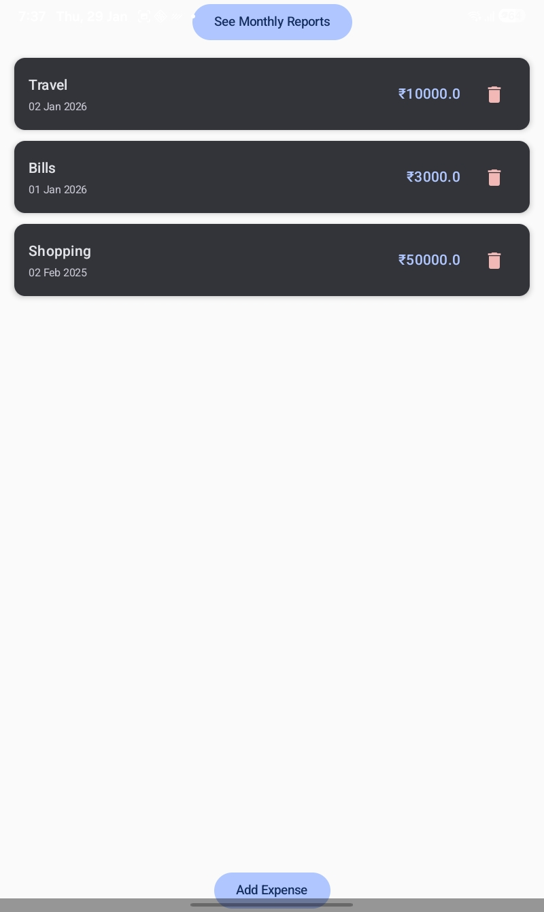
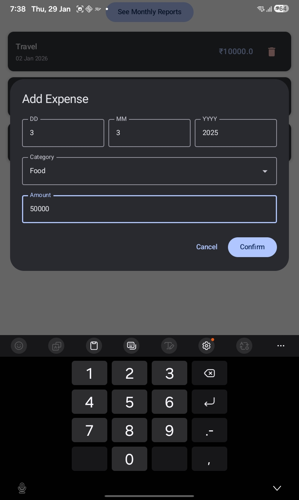
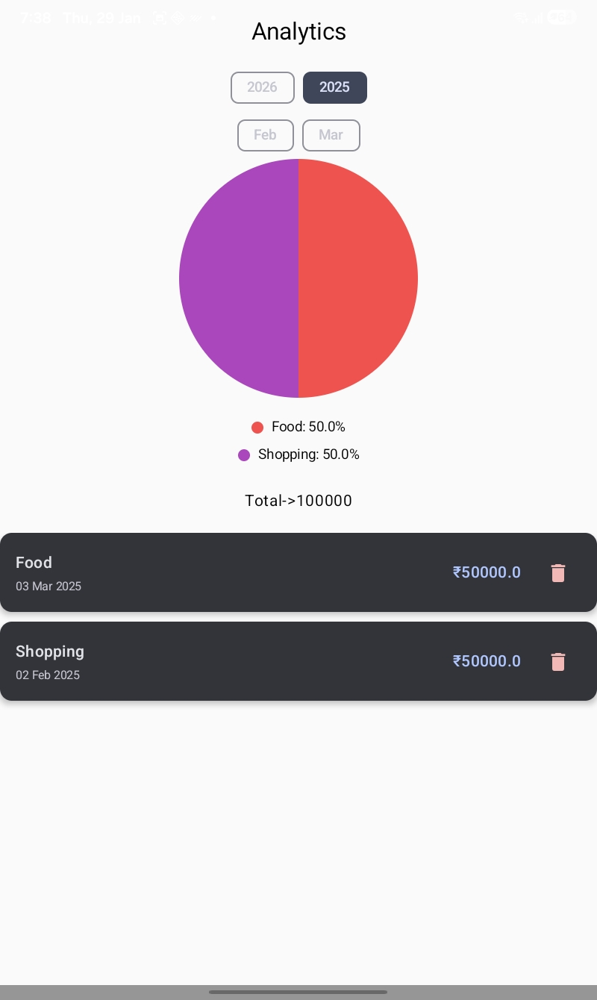
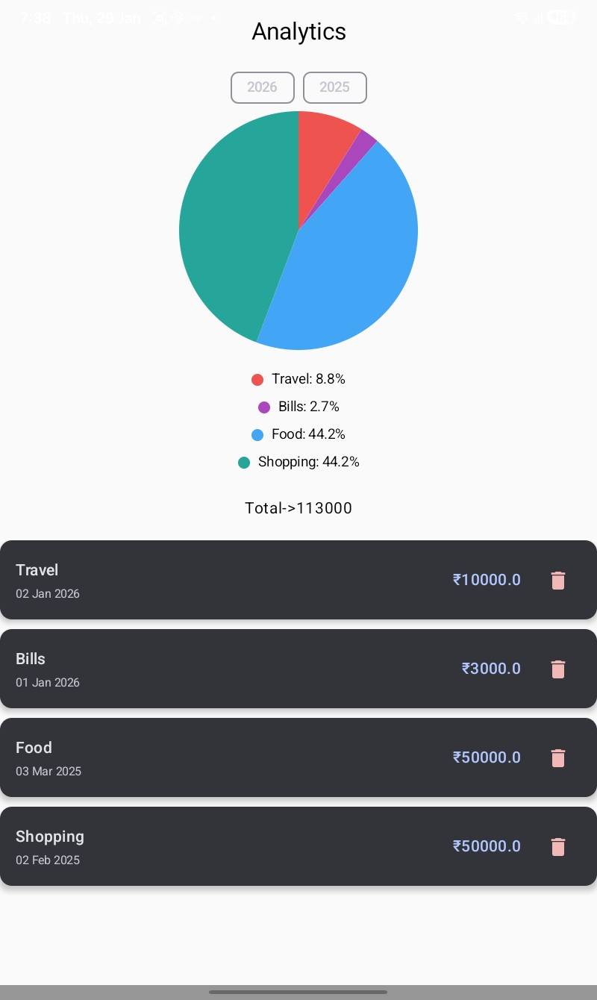

# 📊 Expense Tracker App  
### Project 2 of 10 – Android Internship Portfolio

---

## 📌 About the Project

**Expense Tracker App** is a beginner-to-intermediate level Android application built using **Kotlin** and **Jetpack Compose**.  
It allows users to record daily expenses, filter them by **year and month**, and visualize spending patterns using **category-wise percentage charts**.

This project is part of my **10-project Android Development roadmap**, designed to progress from beginner to advanced level and strengthen my internship-ready Android skills.

---

## ✨ Features

- 🧾 Add, view, and delete expenses  
- 📅 Filter expenses by **Year & Month**  
- 📊 Category-wise **percentage-based Pie Chart**  
- 💰 Total expense calculation for selected month  
- 🧠 Clean **MVVM architecture**  
- 💾 Offline data storage using **Room Database**  
- ⚡ Dependency Injection with **Hilt**

---

## 🛠 Tech Stack

- **Language:** Kotlin  
- **UI:** Jetpack Compose (Material 3)  
- **Architecture:** MVVM  
- **Database:** Room  
- **Dependency Injection:** Hilt  
- **Navigation:** Navigation Compose  
- **Charts:** Canvas API  

---

## 📸 Screenshots

### 🚀 Splash Screen


### 🏠 Home Screen


### ➕ Add Expense Dialog


### 📅 Monthly Screen (Month-wise)


### 📊 Monthly Analytics (Year-wise)


---

## 🧩 Architecture Overview

```text
UI (Jetpack Compose)
 ↓
ViewModel
 ↓
Repository
 ↓
Room Database


## 🧠 Concepts Learned

- Declarative UI development with Jetpack Compose
- Handling recomposition safely and avoiding side effects
- State management using StateFlow and collectAsState
- Sharing ViewModel across multiple screens using Hilt and Navigation
- Filtering data by year and month
- Drawing custom Pie Charts using Canvas API
- Implementing Room database with DAO and Repository pattern
- Applying clean MVVM architecture principles

## 🚀 Android Project Roadmap (2 of 10)

| # | Project Name | Level |
|---|-------------|-------|
| ✅ 1 | Tip Split App | Beginner |
| ✅ 2 | Expense Tracker App | Beginner |
| ⏳ 3 | Weather App | Beginner |
| ⏳ 4 | News App (Pagination) | Intermediate |
| ⏳ 5 | Authentication App (Firebase) | Intermediate |
| ⏳ 6 | Contacts App | Intermediate |
| ⏳ 7 | Real-Time Chat App | Advanced |
| ⏳ 8 | E-Commerce App | Advanced |
| ⏳ 9 | Social Media App | Advanced |
| ⏳ 10 | AI-Powered Android App | Advanced |

